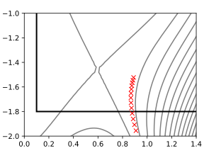
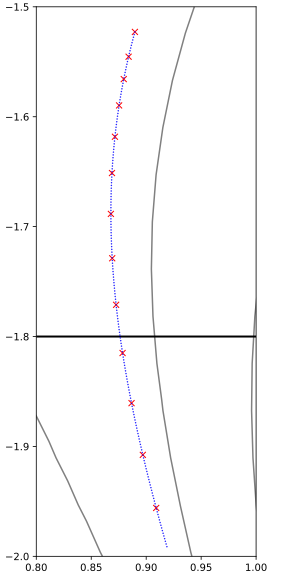
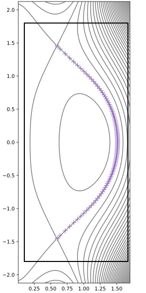
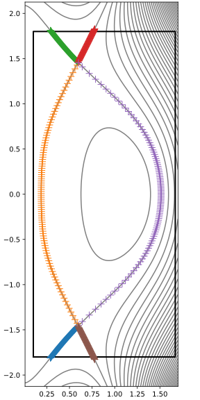
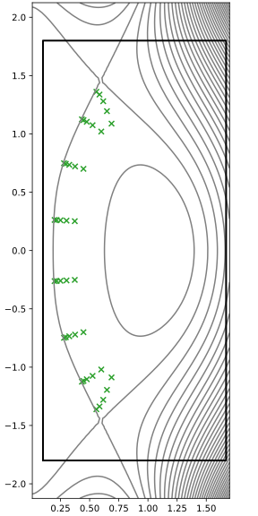

Hypnotoad classes
=================

This section gives a brief overview of the classes defined by hypnotoad.

.. Note: the figures in this page are generated with the script
   images/generate-hypnotoad-classes-figures.py

For illustration in the figures we use a connected double null equilibrium:

.. figure:: images/cdn-Mesh.svg
   :alt: Connected double null grid

   A coarse grid for a connected double null case. Thin gray lines are flux
   surfaces, the thick black line is the wall.

.. autoclass:: hypnotoad.core.equilibrium.PsiContour
   :noindex:
   :exclude-members: __init__, __new__

   The points in an example ``PsiContour``. This one is in the outer lower
   divertor leg.

.. autoclass:: hypnotoad.core.equilibrium.FineContour
   :noindex:
   :exclude-members: __init__, __new__

   The points in an example ``FineContour`` (blue dots, each dot is a point on
   the ``FineContour``). Also shown is the associated ``PsiContour`` (red
   crosses).

.. autoclass:: hypnotoad.core.equilibrium.EquilibriumRegion
   :noindex:
   :exclude-members: __init__, __new__

   The points in an example ``EquilibriumRegion``. This one represents the
   outer core.

.. autoclass:: hypnotoad.core.equilibrium.Equilibrium
   :noindex:
   :exclude-members: __init__, __new__

   An ``Equilibrium`` contains a set of ``EquilibriumRegion`` objects.

.. autoclass:: hypnotoad.cases.tokamak.TokamakEquilibrium
   :noindex:
   :exclude-members: __init__, __new__

.. autoclass:: hypnotoad.core.mesh.MeshRegion
   :noindex:
   :exclude-members: __init__, __new__

   The points in an example ``MeshRegion``. This one represents the
   inner core inside the separatrix.

.. autoclass:: hypnotoad.core.mesh.Mesh
   :noindex:
   :exclude-members: __init__, __new__

.. figure:: images/cdn-Mesh.svg
   :alt: Mesh

   The ``Mesh`` is a collection of ``MeshRegion`` objects.

.. autoclass:: hypnotoad.core.mesh.BoutMesh
   :noindex:
   :exclude-members: __init__, __new__
