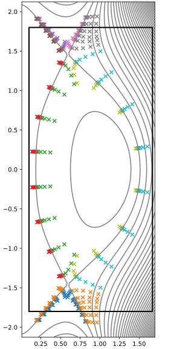

Nonorthogonal grid
==================

If you are using the GUI, :ref:`radial-grid:Radial grid` and this page
correspond to the process that happens when the 'Run' button is pressed, which
should result in a figure something like :ref:`the figure below <mesh-fig>`
being shown in the right panel. It is also possible to adjust just the
``nonorthogonal_*`` settings and quickly rebuild the grid using the 'Regrid'
button (see below) - this can be very useful when experimenting to find good
settings!

Nonorthogonal grids are constructed by defining the poloidal spacing on each
:class:`PsiContour <hypnotoad.core.equilibrium.PsiContour>` independently. A
sensible grid results because the poloidal spacings are defined in a consistent
way that varies smoothly with :math:`\psi`.

.. note:: This approach was taken because it was convenient at the time the
   feature was developed. It is not necessarily the most robust, or the
   simplest for producing nice grids. More work in this area would be good -
   see `feature request #146
   <https://github.com/boutproject/hypnotoad/issues/146>`_.

There are a few options for setting the poloidal spacing, described in 
detail in the subsections below:

* Default method: can produce good-quality grids for production simulations.
  Has may input parameters and usually requires extensive manual tweaking. Not
  very robust.
* Linear spacing: Robust but inflexible, and produces grids with discontinuous
  spacing. Not recommended for simulations, but may be useful for
  exploration/scoping or to provide inputs to other tools.
* Nonorthogonal X-point: with approximately orthogonal divertor targets. Should
  result an an almost orthogonal grid, but alleviate the very small poloidal
  spacing of grid cells on the 'seams' around the X-points that usually results
  from fully orthogonal grids, and which often limits the timestep size.

Default method
--------------

The default method for nonorthogonal grids combines three properties:

* Close to orthogonal far from X-points and targets
* Near the divertor targets, grid spacing defined in terms of poloidal distance
  from the targets. All ``PsiContour``\s that intersect that target have the
  same poloidal-distance spacing at the target, in the limit of high resolution.
* Near the X-point, grid spacing defined in terms of the distance perpendicular
  to the poloidal region boundaries (the lines that follow :math:`\nabla\psi`
  away from the X-point). All ``PsiContour``\s that intersect that region
  boundary have the same perpendicular-distance spacing at the boundary, in the
  limit of high resolution. This is nicer than fixed poloidal-distance spacing,
  because of the very different shapes of flux surfaces near to the X-point
  compared to those further away. 

The grid in each region is created by combining the poloidal positions of three
separate grids, weighted appropriately:

* An orthogonal grid, whose spacings at the ends are set by
  ``xpoint_poloidal_spacing_length`` and ``target_*_poloidal_spacing_length``.
  The orthogonal grid is constructed in a similar way to the method described
  in :ref:`orthogonal-grid:Orthogonal grid`. However, it is not necessary to
  increase the poloidal spacing near the X-point, so the spacing along the
  :class:`EquilibriumRegion <hypnotoad.core.equilibrium.EquilibriumRegion>` is
  set by a combination of the spacing methods used for either end, with a
  weight that varies sinusoidally (over half a period, proportional to the
  poloidal index) between the two ends.
* Two grids that set the spacing near either end, with fixed poloidal spacing
  (if the end is a target) or fixed perpendicular spacing (if the end is an
  X-point). The poloidal spacing of these grids at the ends is set by
  ``nonorthogonal_xpoint_poloidal_spacing_length`` and
  ``nonorthogonal_target_*_poloidal_spacing_length``.

The grids are combined using some weights that vary both poloidally and
radially.

Poloidally, the weight for the orthogonal grid component is large far from
X-points and targets. The weight for each 'spacing near an end' grid is large
near its end. The weights for the 'end' grids have a Gaussian decay away from
the end, with a range set by ``nonorthogonal_xpoint_spacing_range`` and
``nonorthogonal_target_spacing_range``.

Radially, the poloidal ranges of the weights need to vary. Near the
separatrices, the weight should be almost all orthogonal very close to the ends
of the grid, because the orthogonal grid is smooth across the separatrix,
whereas the X-point end grids are not, and the target end grids might not be
(depending on the shape of the target). However, near the radial edges of the
grid, the 'end' grids need to have the largest weight for a significant
distance from the end, because the orthogonal grid would give very compressed
poloidal spacing at X-point ends, while at target ends the orthogonal grid
meets the target at the separatrix, but as it cannot follow the target, the
orthogonal grid diverges further from the target with radial distance.
Therefore the range over which the grid transitions from the 'end' grid to the
orthogonal grid should be small at the separatrix, but larger far from the
separatrix. This is implemented by having separate range parameters for the
inner and outer edges of the grid,
``nonorthogonal_*_poloidal_spacing_range_inner`` and
``nonorthogonal_*_poloidal_spacing_range_outer``, while
``nonorthogonal_*_poloidal_spacing_range`` controls the range at the
separatrix. By default the ``..._inner`` and ``..._outer`` parameters are twice
as large as the separatrix range, but can be set independently and likely need
increasing for the final grid. The range :math:`r` used for each contour
between the separatrix and the radial boundary interpolates between the two
values using a power law:

.. math::

   \begin{eqnarray}
   w(i_\mathrm{x,subregion}) &=& \left(\frac{i_\mathrm{x,subregion}}{n_\mathrm{x,subregion}-1}\right)^p \\
   r(i_\mathrm{x,subregion}) &=& (1-w(i_\mathrm{x,subregion})) r_\mathrm{separatrix} + w(i_\mathrm{x,subregion}) r_\mathrm{boundary}
   \end{eqnarray}

where :math:`p` is a power set by ``nonorthogonal_radial_range_power``,
:math:`i_\mathrm{x,subregion}` is the radial index in the subregion which
starts from 0 on the separatrix, and :math:`n_\mathrm{x,subregion}` is the
total number of radial points in the subregion.

This figure illustrates the 'end' grid shapes by artificially increasing the
range over which they apply, zooming in on the outer, lower divertor leg:

.. list-table::

   * - .. figure:: images/cdn-nonorth-combined.svg
          :alt: Combined

     - .. figure:: images/cdn-nonorth-target-spacing.svg
          :alt: Target spacing

     - .. figure:: images/cdn-nonorth-xpoint-spacing.svg
          :alt: Target spacing

   * - The 'actual' grid, with fairly standard settings.

     - The 'target range' is large, emphasising the 'target end' grid. The
       corners imprinted by the target propagate a long way into the grid, and
       the grid lines are not smooth at the separatrix, except very close to
       the target.

     - The 'X-point range' is large, emphasising the 'X-point end' grid. The
       gridding in the SOL and PFR is essentially independent, as they are set
       relative to their own boundaries (using the perpendicular distance from
       the boundary). Gives grid lines parallel to the region boundary the
       region boundary, but has a discontinuity at the separatrix.

The ``nonorthogonal_*`` parameters often need a lot of manual tweaking to make
a good grid. To speed up the process, after an initial grid is generated the
``nonorthogonal_*`` parameters (but no others) can be adjusted and the grid
rebuilt by using the ``Regrid`` button. This is faster because the
:class:`FineContour <hypnotoad.core.equilibrium.FineContour>` objects,
:class:`EquilibriumRegion <hypnotoad.core.equilibrium.EquilibriumRegion>`
objects and orthogonal grid can all be reused unchanged. To change any other
parameters, it is necessary to click 'Run' again to rebuild the grid from
scratch. For reproducibility, it is recommended to save the final set of
parameters, once you are happy with the grid, into an input file, and then
build the production grid using the command line interface
``hypnotoad-geqdsk``. The output should be the same as using the GUI
interactively, but bugs might introduce some dependence on the history of the
interactive session, which it would be best to keep out of the production grid
file.

   An example nonorthogonal grid for a connected double null configuration.
   The grid is aligned to the wall. The compression of the poloidal spacing,
   moving radially away from the X-point is limited -- far from the X-point the
   poloidal spacing is approximately constant with changes in radius.

### Technical details

The spacing is implemented by defining three separate :ref:`spacing functions
<spacing-functions:Spacing functions>` and combining them with certain weights
using :meth:`EquilibriumRegion.combineSfuncs()
<hypnotoad.core.equilibrium.EquilibriumRegion.combineSfuncs>`.

The initial spacing on the :class:`EquilibriumRegion
<hypnotoad.core.equilibrium.EquilibriumRegion>` objects, which is used to build
the orthogonal grid, is set by a call to
:meth:`EquilibriumRegion.getRegridded()
<hypnotoad.core.equilibrium.EquilibriumRegion.getRegridded>`. The spacing
function for the orthogonal grid is created in
:meth:`MeshRegion.addPointAtWallToContours()
<hypnotoad.core.mesh.MeshRegion.addPointAtWallToContours>` by calling
:meth:`PsiContour.contourSfunc()
<hypnotoad.core.equilibrium.PsiContour.contourSfunc>`, which interpolates the
distance along the contour as a function of poloidal grid index from the
initially created orthogonal grid.

The 'fixed poloidal spacing' function used for divertor target ends of
subregions is created by :meth:`EquilibriumRegion.getSfuncFixedSpacing()
<hypnotoad.core.equilibrium.EquilibriumRegion.getSfuncFixedSpacing>`.

The 'fixed perpendicular spacing' function used for X-point ends of subregions
is created by :meth:`EquilibriumRegion.getSfuncFixedPerpSpacing()
<hypnotoad.core.equilibrium.EquilibriumRegion.getSfuncFixedPerpSpacing>`.

.. note:: Other methods for poloidal spacing than the default described on this
   page can be chosen by changing the ``nonorthogonal_spacing_method`` setting,
   but the other methods are intended mostly for debugging.

Linear spacing
--------------

To use set `nonorthogonal_spacing_method = "linear"` and
`poloidal_spacing_option = "linear"`.

In each region (target to X-point, or X-point to X-point) distributes the grid
points poloidally with a uniform spacing in poloidal (not parallel!) distance.

Nonorthogonal X-point
---------------------

To use set `nonorthogonal_target_all_poloidal_spacing_range = None` and either
leave `nonorthogonal_target_all_poloidal_spacing_range_inner` and
`nonorthogonal_target_all_poloidal_spacing_range_outer` unset, or set them to
`None`.

In most of the grid, uses the orthogonal spacing function so that the grid is
approximately orthogonal. Near to the X-point uses a fixed perpendicular
spacing from the region boundaries that start from the X-point and follow the
directions perpendicular to flux surfaces. This should not make the grid
strongly nonorthogonal, but reduces the poloidal compression of grid points in
these areas, which can force timestep reductions (or badly-conditioned matrices
for implicit solvers, etc.).

Ideally, codes using grids generated with this option should support
nonorthogonal grids. The sensitivity of results to slight non-orthogonality in
codes that assume orthogonal grids has not been tested yet...
