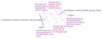

Nonorthogonal tips
==================

This page is intended to collect the material for a page in the docs with
advice on how to generate a non-orthogonal grid, since there are a lot of
options to tweak. Anyone who manages to generate a good grid, please add advice
here!

The settings
------------

These settings are part of the general user-options, and can only be set when
the ``Equilibrium`` and ``Mesh`` are first recreated. If they need to be
changed, you need to re-create ``Equilibrium`` and ``Mesh``. However, they have
slightly different meanings and default values when creating nonorthogonal
grids than when creating orthogonal ones

+--------------------------------------------------------------+-------------+
+==============================================================+=============+
| Set, in arbitrary normalised units, the grid spacing at the  |             |
|                                                              |             |
| end of a region, used to create an orthogonal grid of points |             |
|                                                              |             |
| when the contours are first created, from which a spacing    |             |
|                                                              |             |
| function (``sfunc_orthogonal``) is defined by interpolation  |             |
+--------------------------------------------------------------+-------------+
| ``xpoint_poloidal_spacing_length``                           | X-point end |
+--------------------------------------------------------------+-------------+
| ``target_poloidal_spacing_length``                           | target end  |
+--------------------------------------------------------------+-------------+

The following settings can be changed, and the grid reconfigured by calling
``redistributePoints()`` (or using the 'Regrid' button in the GUI), rather than
creating a new Mesh object (which is expensive). Note to be doubly sure of the
reproducibility of the final grid, it is recommended to use
``redistributePoints()`` or the 'Regrid' button only for prototyping: once you
have finished prototyping, save the final settings to a file and generate the
production grid directly from that file.

+-------------------------------------------------------+------------------------------------------------+
+=======================================================+================================================+
| grid spacing for perpendicular or poloidal            |                                                |
|                                                       |                                                |
| spacing function at the ends of a region              |                                                |
+-------------------------------------------------------+------------------------------------------------+
| ``nonorthogonal_xpoint_poloidal_spacing_length``      | X-point end                                    |
+-------------------------------------------------------+------------------------------------------------+
| ``nonorthogonal_target_poloidal_spacing_length``      | wall end                                       |
+-------------------------------------------------------+------------------------------------------------+
|                                                       |                                                |
+-------------------------------------------------------+------------------------------------------------+
| ranges near the X-point over which fixed              |                                                |
|                                                       |                                                |
| perpendicular position changes to orthogonal          |                                                |
|                                                       |                                                |
| position                                              |                                                |
+-------------------------------------------------------+------------------------------------------------+
| ``nonorthogonal_xpoint_poloidal_spacing_range``       | range at the separatrix side of a region, also |
|                                                       |                                                |
|                                                       | used as the default for inner and outer sides  |
+-------------------------------------------------------+------------------------------------------------+
| ``nonorthogonal_xpoint_poloidal_spacing_range_inner`` | range at an inner side                         |
+-------------------------------------------------------+------------------------------------------------+
| ``nonorthogonal_xpoint_poloidal_spacing_range_outer`` | range at an outer side                         |
+-------------------------------------------------------+------------------------------------------------+
|                                                       |                                                |
+-------------------------------------------------------+------------------------------------------------+
| ranges near the wall over which fixed poloidal        |                                                |
|                                                       |                                                |
| position changes to orthogonal position               |                                                |
+-------------------------------------------------------+------------------------------------------------+
| ``nonorthogonal_target_poloidal_spacing_range``       | range at the separatrix side of a region, also |
|                                                       |                                                |
|                                                       | used as the default for inner and outer sides  |
+-------------------------------------------------------+------------------------------------------------+
| ``nonorthogonal_target_poloidal_spacing_range_inner`` | range at an inner side                         |
+-------------------------------------------------------+------------------------------------------------+
| ``nonorthogonal_target_poloidal_spacing_range_outer`` | range at an outer side                         |
+-------------------------------------------------------+------------------------------------------------+
|                                                       |                                                |
+-------------------------------------------------------+------------------------------------------------+
| ``nonorthogonal_radial_range_power``                  | gives ``p`` in ``(1-x**p)*range_sep +``        |
|                                                       |                                                |
|                                                       | ``x**p*range_edge`` which is the actual        |
|                                                       |                                                |
|                                                       | poloidal range used on a contour where         |
|                                                       |                                                |
|                                                       | ``range_sep`` is the range on the separatrix,  |
|                                                       |                                                |
|                                                       | ``range_edge`` is the range on an inner or     |
|                                                       |                                                |
|                                                       | outer edge and ``x`` is proportional to the    |
|                                                       |                                                |
|                                                       | radial index of the contour, ``0`` on the      |
|                                                       |                                                |
|                                                       | separatrix and ``1`` on the edge               |
+-------------------------------------------------------+------------------------------------------------+
| ``nonorthogonal_spacing_method``                      | switches between different spacing methods.    |
|                                                       |                                                |
|                                                       | The default ``"combined"`` is described here,  |
|                                                       |                                                |
|                                                       | the others are mainly useful for debugging as  |
|                                                       |                                                |
|                                                       | they give access to the methods that are       |
|                                                       |                                                |
|                                                       | combined in the default one                    |
+-------------------------------------------------------+------------------------------------------------+

Explanation
-----------
This sketch attempts to indicate what the 'range' parameters do

Comments
--------
- To make a smooth grid line across the separatrix, make
  ``nonorthogonal_range_*`` for the separatrix sides of regions small so that
  points on contours near the separatrix are very close to the positions they
  would have with orthogonal spacing
- Orthogonal spacing would make the points at the inner or outer edges very
  close together (near X-points) or displaced from the wall (near targets), so
  the ``nonorthogonal_*_poloidal_spacing_range_*`` for the inner or outer edges
  probably needs to be larger.
- ``nonorthogonal_range_radial_power`` gives some control over the radial
  position of the transition in the (poloidal) ranges, use values in the range
  [0, 1) to make more contours close to inner or outer side spacing, or values
  >1 to make more contours close to the separatrix spacing
- Grid generation is more robust when
  ``nonothogonal_target_poloidal_spacing_range_*`` is fairly large, as this
  prevents the grid from being affected by regions where the orthogonal spacing
  function would put the grid points behind the target. The default values for
  these parameters have therefore been made fairly large, to ensure an initial
  grid can be generated most of the time. You probably want to reduce these
  parameters, at least ``nonorthogonal_target_poloidal_spacing_range`` which is
  used for the range near the separatrix; the separatrix ends on the target in
  the initial grid from which the orthogonal spacing function is created, so it
  is fine to push the final spacing close to orthogonal near the separatrix -
  at the outer edges you may need to keep the range larger.
- Grid generation can also be more robust when
  ``nonorthogonal_xpoint_poloidal_spacing_range_*`` is fairly large. It may be
  useful to set these parameters to fairly large (~1) values initially,
  especially if grid generation fails with the defaults, before refining.
- The parameters ``xpoint_poloidal_spacing_length`` and
  ``target_poloidal_spacing_length`` are used for nonorthogonal grid generation
  - they control the grid spacing in the initial orthogonal grid which is used
  to create ``sfunc_orthogonal`` spacing functions. They have different
  defaults than when an orthogonal grid is generated, but are not part of the
  ``nonorthogonal_*`` family of options because they cannot be changed after
  the ``Equilibrium`` and ``Mesh`` are first created.
- The default of setting ``nonorthogonal_target_poloidal_spacing_length =
  target_poloidal_spacing_length`` is probably a reasonable choice - it means
  that the spacing of the orthogonal-spacing and poloidal-spacing grids is the
  same on the targets at the separatrix, which is probably the best choice to
  combine them consistently.
- It is probably good to have ``nonorthogonal_xpoint_poloidal_spacing_length``
  somewhat smaller than ``xpoint_poloidal_spacing_length`` (by default it is a
  factor 4 smaller). This is because the perpendicular-spaced grid lines have a
  sharp corner at the separatrix, whereas the orthogonal-spaced contours are
  smooth, but get much closer to the normal from the X-point as you go radially
  away from the separatrix. That means if the spacing on the separatrix was the
  same for the orthogonal and perpendicular grid lines, weighting towards the
  orthogonal positions would make the curve 'overshoot' the
  perpendicular-spacing grid line, resulting in a grid line which changes the
  sign of its curvature several times. Making the
  ``xpoint_poloidal_spacing_length`` larger than
  ``nonorthogonal_xpoint_poloidal_spacing_length`` allows for less-curved grid
  lines (if the ``range`` parameters are adjusted appropriately).
- The default ``combined`` spacing method uses uniform poloidal spacing near
  walls, and uniform perpendicular spacing (perpendicular to a line along the
  Grad(psi) direction through the X-point) near the X-point.
