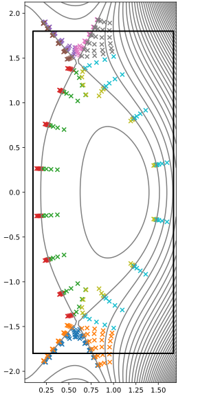

Orthogonal grid
===============

If you are using the GUI, :ref:`radial-grid:Radial grid` and this page
correspond to the process that happens when the 'Run' button is pressed, which
should result in a figure something like :ref:`the figure below <mesh-fig>`
being shown in the right panel.

The remaining step to determine the grid point positions is to define the
poloidal spacing. For an orthogonal grid this is done by first creating a
poloidal grid on the :class:`EquilibriumRegion
<hypnotoad.core.equilibrium.EquilibriumRegion>` objects that represent the
separatrix segments (or a combination of the primary and secondary separatrices
around the core of a disconnected double null configuration), and then
following the :math:`\nabla\psi` direction perpendicular to the flux surfaces
to find the positions of the other grid points. These grid points are then
assigned to :class:`PsiContour <hypnotoad.core.equilibrium.PsiContour>` objects
which are in turn collected into :class:`MeshRegion
<hypnotoad.core.mesh.MeshRegion>` objects for each sub-region of the grid. The
various :class:`MeshRegion <hypnotoad.core.mesh.MeshRegion>` objects are
collected into a :class:`Mesh <hypnotoad.core.mesh.Mesh>`.

The default method for defining the poloidal grid on an
:class:`EquilibriumRegion <hypnotoad.core.equilibrium.EquilibriumRegion>` has a
poloidal spacing proportional to :math:`1/\sqrt{s-s_X}` near to X-points, where
:math:`s_X` is the position of the X-point. If the poloidal spacing was
constant on the separatrix, then as the poloidal resolution is increased (by
increasing the number of poloidal grid points) then the flux expansion at the
X-point (or rather, the corresponding flux compression moving away from the
X-point) would result in the poloidal spacing of the grid near the radial lines
leading away from the X-point becoming compressed, with the grid spacing
decreasing more quickly than :math:`1/n_y`. The :math:`1/\sqrt{s-s_X}` spacing
is an attempt to counteract this effect, motivated by the observation the
X-point is a stationary point of :math:`\psi(R,Z)`, so close to the X-point
:math:`\psi` varies quadratically with distance from the X-point. This does not
prove that the choice of spacing is a good one, but it seems to work OK.

.. _mesh-fig:

   An example orthogonal grid for a connected double null configuration. Note
   the compression of the poloidal grid spacing as you move radially away from
   the X-point -- it is particularly strong towards the core.

Due to the orthogonality constraint, it is not possible to make the poloidal
grid spacing vary smoothly between regions that are joined at the poloidal
position of an X-point. The grid spacing is continuous, as the coefficients of
the :math:`1/\sqrt{s-s_X}` term are the same in adjacent regions.

The poloidal spacing of the grid is controlled by
``xpoint_poloidal_spacing_length`` at the X-points, and by the various
``target_*_poloidal_spacing_length`` at the targets
(``target_all_poloidal_spacing_length`` can be used to set the default for all
targets at once, it is overridden by the more specific settings if they are
given).

The default method does not guarantee a :ref:`monotonic spacing function
<monotonic-requirement>`, but it is usually not hard to adjust the spacing
parameters at either end to make it monotonic.

Technical details
-----------------

The default poloidal spacing is implemented by the :ref:`spacing function
<spacing-functions:Spacing functions>`:

.. automethod:: hypnotoad.core.equilibrium.EquilibriumRegion.getSqrtPoloidalDistanceFunc
   :noindex:

It is possible to use other spacing functions by changing the
``poloidal_spacing_method`` setting, but this is not recommended.
