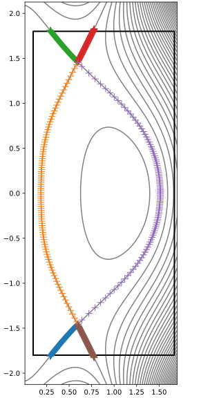

Topology
========

If you are using the GUI, this page corresponds to the process that happens
when the geqdsk file with equilibrium magnetic data is loaded, which should
result in a figure something like `the figure at the bottom of this page
<equilibrium-fig>` being shown in the right panel.

The grid generation process begins with :class:`TokamakEquilibrium
<hypnotoad.cases.tokamak.TokamakEquilibrium>` loading the equilibrium data (see
:ref:`inputs:Magnetic equilibrium`).

The primary O-point and one or two primary X-points are identified, checking
how many X-points exist within the
:math:`\psi_N=(\psi-\psi_\mathrm{core})/(\psi_\mathrm{SOL}-\psi_\mathrm{core})`
value specified for the outer radial boundary of the grid.

   The O-point (blue plus) and X-points (red crosses).

Starting from the X-point(s) the separatrices are traced along the divertor
legs to the wall, and around the core points are placed along the separatrix
(for a single null or connected double null) or onto a :math:`\psi` value that
interpolates between those of the primary and secondary X-points, so that the
resulting line connects the two X-points. The resulting points are used to
construct a set of :class:`EquilibriumRegion
<hypnotoad.core.equilibrium.EquilibriumRegion` objects, one for each region,
which provide the skeleton from which the grid is built.

.. _equilibrium-fig:

   An ``Equilibrium`` contains a set of ``EquilibriumRegion`` objects.
